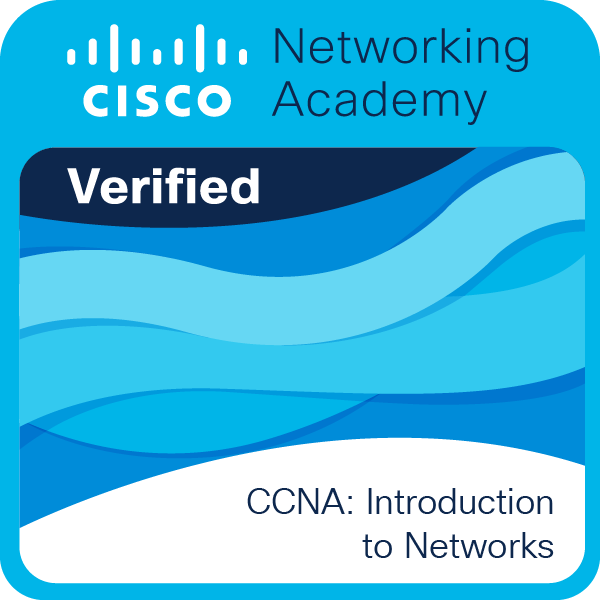
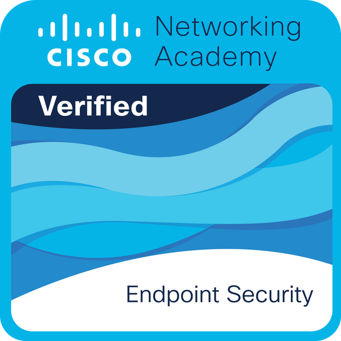
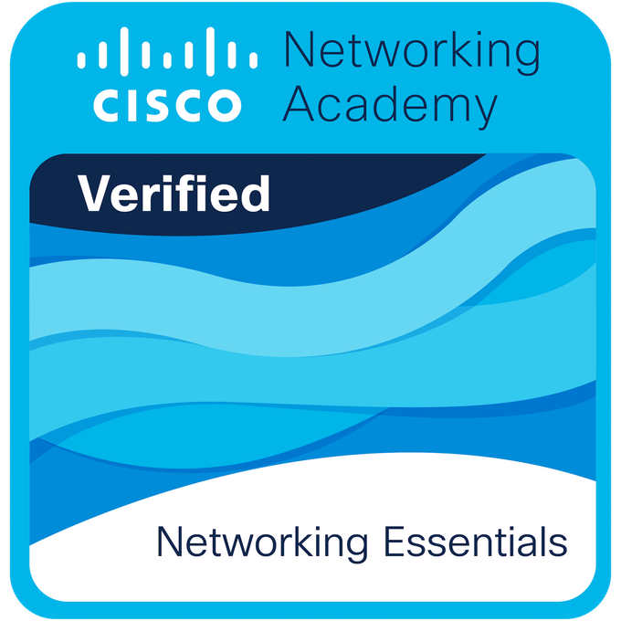

  

  

   <a href="README.md">Português</a> | <a href="README_en.md">English</a> | <a href="README_es.md"><u><b>Spanish</b></u></a>

  <b>Data Analyst | Data Engineering Enthusiast</b>

  

    Motivado por los desafíos relacionados con los datos, la automatización y la tecnología, trabajo en la creación de soluciones que transforman la información en decisiones estratégicas. Mi experiencia incluye análisis de datos, desarrollo de dashboards, automatización de procesos y soporte a la toma de decisiones en entornos corporativos de gran envergadura.
    Con conocimientos en Python, SQL, Power BI, Databricks e infraestructura de TI, busco evolucionar continuamente en las áreas de Datos, Analytics, Ingeniería de Datos y Ciberseguridad. Me interesa construir canalizaciones (pipelines) de datos, automatizar flujos de información y desarrollar soluciones escalables y seguras que generen un impacto real en el negocio.
    Mi objetivo es utilizar la tecnología para simplificar procesos complejos, aumentar la eficiencia operativa y apoyar a las organizaciones a través de una cultura basada en datos, innovación y mejora continua.
  

&nbsp;

## ⛩️ Habilidades Técnicas
<i>"Mi stack tecnológico está orquestado para soportar todo el ciclo de vida del dato: desde la ingesta robusta hasta el procesamiento a gran escala, visualización y virtualización de alto rendimiento."</i>

#### Lenguajes y Datos:
&nbsp;
&nbsp;
&nbsp;
&nbsp;
&nbsp;

#### BI y Analytics:
&nbsp;
&nbsp;
&nbsp;
&nbsp;
&nbsp;

#### Herramientas e Infraestructura:
&nbsp;
&nbsp;
&nbsp;
&nbsp;
&nbsp;
&nbsp;
&nbsp;
&nbsp;
&nbsp;
&nbsp;

#### Control de versiones:
&nbsp;
&nbsp;
&nbsp;
&nbsp;

&nbsp;

## Badges

  
  <table style="border:none;">
    <tr>
      <td align="center" style="padding: 15px;">
        
        
<b>CCNA</b>

      </td>
      <td align="center" style="padding: 15px;">
        
        
<b>Cyber Essentials</b>

      </td>
      <td align="center" style="padding: 15px;">
        
        
<b>Endpoint Security</b>

      </td>
      <td align="center" style="padding: 15px;">
        
        
<b>Network Essentials</b>

      </td>
    </tr>
  </table>
  
  
<i>Validando siempre mis competencias en infraestructura de red y seguridad de la información.</i>

## 📜 Trayectoria Profesional

  

    
    

      <h2 style="margin: 0; font-family: serif;">Santander Brasil</h2>
      
<b>Data Analyst | Pasantía</b>

      
<b>Periodo:</b> Julio/2025 – Julio/2026

    

  

  

## 📈 Estadísticas
<table>
  <tr>
    <td>
      
    </td>
    <td>
      
    </td>
  </tr>
</table>

 
   

&nbsp;

## 📬 ¿Hablamos?

  
  

  

  

 

